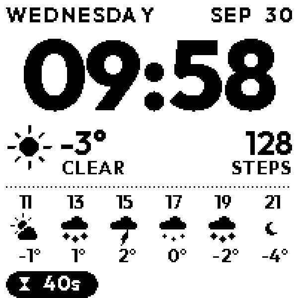
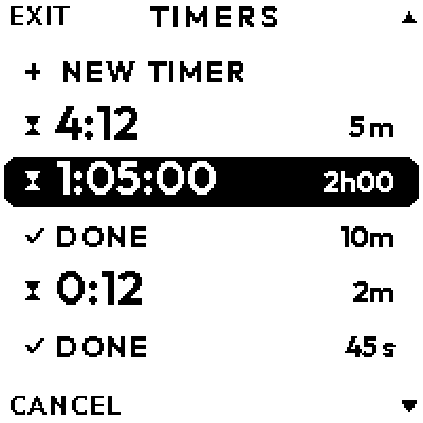

# Custom Watchy

Our firmware for [Watchy](https://watchy.sqfmi.com), forked from [sqfmi/Watchy](https://github.com/sqfmi/Watchy).

  
  
  
  

- 24h time, weekday, month and date
- Step count, reset daily
- Current weather plus the next 12 hours in 2-hour steps ([Open-Meteo](https://open-meteo.com), no API key)
- Down button opens a multi-timer app; timers wake the watch and vibrate when done; the 3 most recent show on the face
- Light theme everywhere, including the stock menu
- No flashing: partial screen updates, with a full (ghost-clearing) refresh at most once an hour or via Menu > Refresh Screen

Screenshots are rendered on the host by `firmware/tools/sim`, from the same drawing code the watch runs.

## Layout

- [`firmware/`](firmware/README.md): our watch face and apps (PlatformIO project). Build, flash and button docs are there.
- `src/`: the Watchy library, with small changes: `onWake()` / `nextAlarm()` hooks for extra wakeups, light menu theme,
  `refresh()` (partial updates, full at most hourly) plus a Refresh Screen menu item,
  fixed dependency list (`library.json`).

## Upstream

Hardware, guides and the original firmware: https://watchy.sqfmi.com/docs/getting-started
