# Custom Watchy

Our firmware for [Watchy](https://watchy.sqfmi.com), forked from [sqfmi/Watchy](https://github.com/sqfmi/Watchy).
Runs on Watchy V3 (default) and V1/V2.

Every screenshot below is rendered by `firmware/tools/sim` from the same drawing code the watch runs.

## Watch face

<table>
  <tr>
    <td>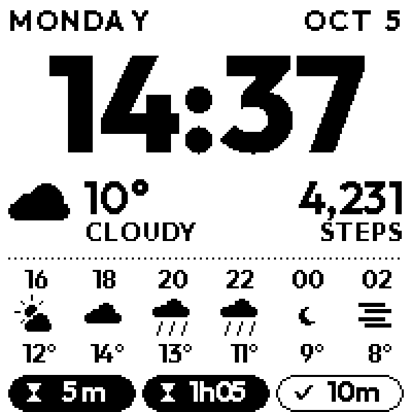</td>
    <td>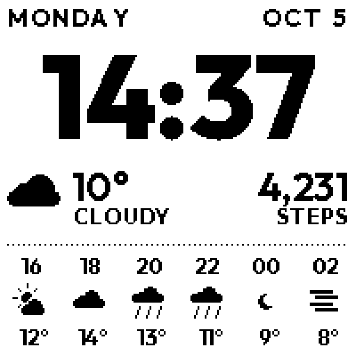</td>
    <td>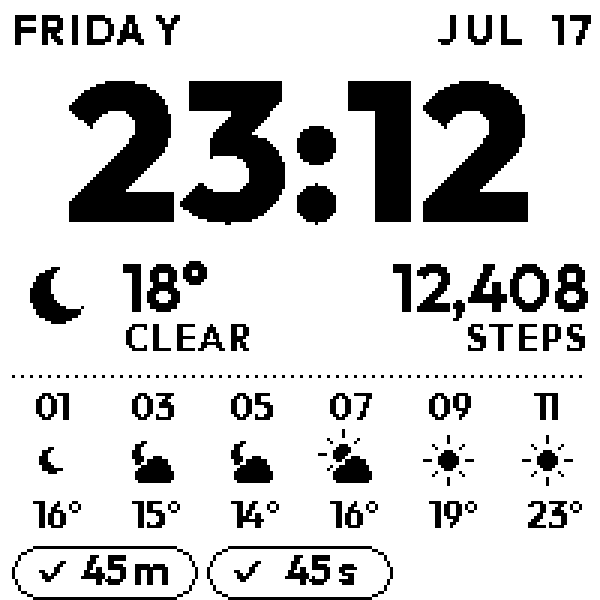</td>
  </tr>
  <tr>
    <td align="center">Running and finished timers</td>
    <td align="center">No timers: layout spreads out</td>
    <td align="center">Clear night</td>
  </tr>
  <tr>
    <td>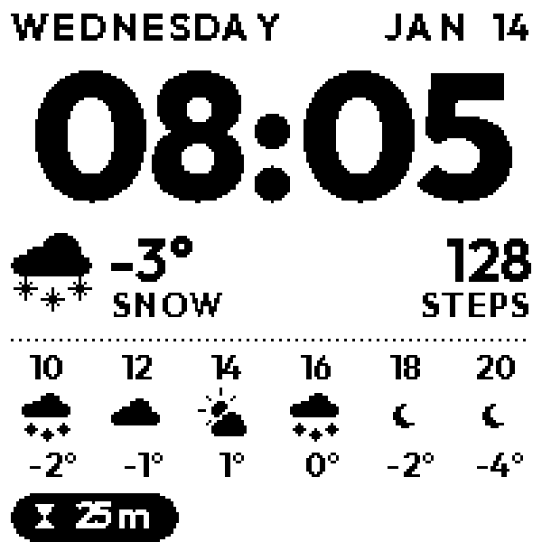</td>
    <td>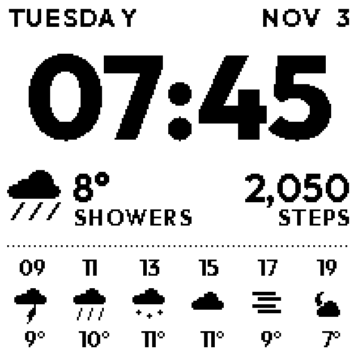</td>
    <td>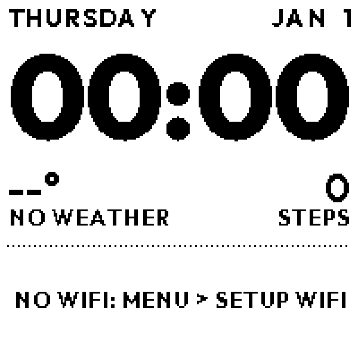</td>
  </tr>
  <tr>
    <td align="center">Snow</td>
    <td align="center">Showers, storm, drizzle, fog</td>
    <td align="center">No WiFi yet</td>
  </tr>
</table>

## Timers (Down button on the face)

<table>
  <tr>
    <td>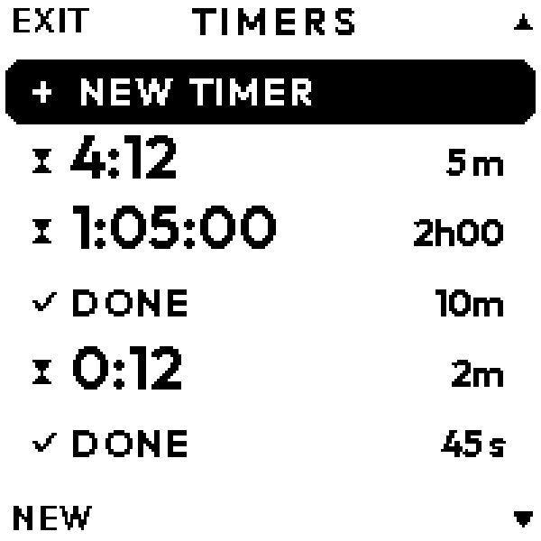</td>
    <td>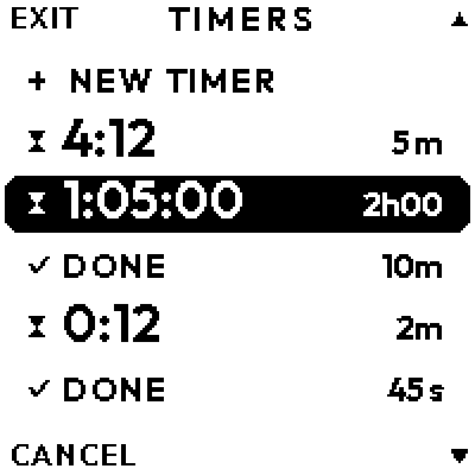</td>
    <td>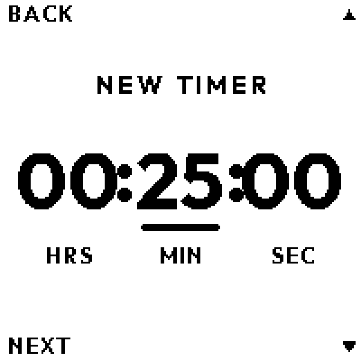</td>
    <td>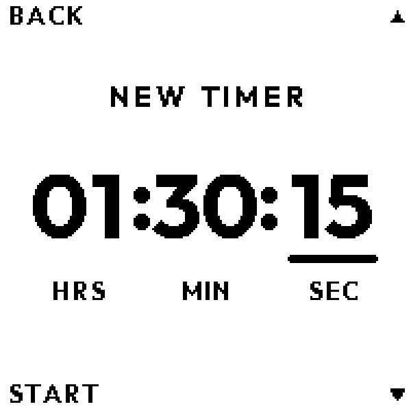</td>
  </tr>
  <tr>
    <td align="center">List</td>
    <td align="center">Menu cancels the selected timer</td>
    <td align="center">New timer</td>
    <td align="center">Last field: Menu starts it</td>
  </tr>
</table>

## Menu (Menu button)

<table>
  <tr>
    <td>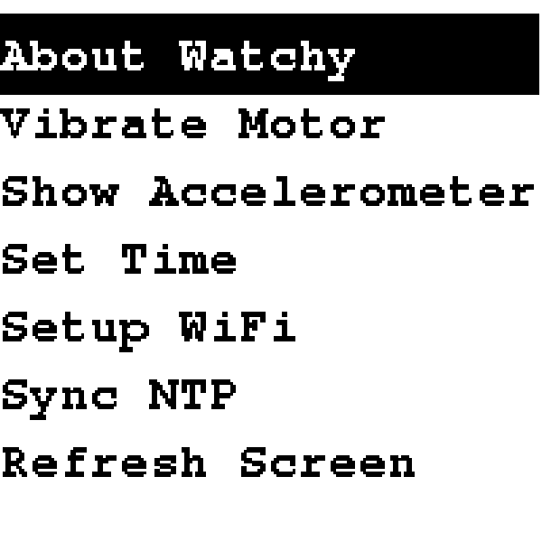</td>
    <td>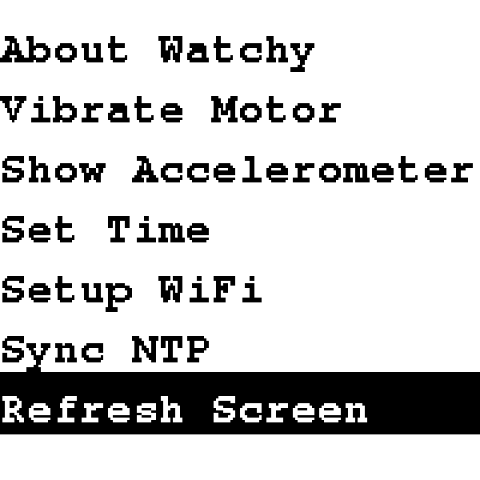</td>
  </tr>
  <tr>
    <td align="center">Stock menu, light theme</td>
    <td align="center">New: Refresh Screen</td>
  </tr>
</table>

## Changes from the original firmware

### Watch face and apps (`firmware/`, new)

- Watch face: 24h time, weekday, month and date, daily step count, current weather, the next 12 hours
  in 2-hour steps, and the 3 most recent timers. The layout spreads out when there are no timers.
- Weather from [Open-Meteo](https://open-meteo.com) (free, no API key) instead of OpenWeatherMap.
  Fetched every 30 minutes (every 5 while there is no forecast); 25 hourly slots are kept, so the
  forecast stays correct for about 12 hours offline. Weather icons are drawn from shapes, not bitmaps.
- Time syncs over NTP with each weather fetch, using the location's UTC offset, so DST is automatic.
- Timer app on the Down button: up to 8 timers at once, hours/minutes/seconds picker that remembers
  the last duration, cancel from the list. The watch wakes at the exact second a timer ends and vibrates.
- On-screen labels next to the physical buttons; presses made during a screen refresh are not lost.
- V3: the clock starts from the build time after flashing instead of 1900, until the first NTP sync.

### Library (`src/`)

- Light theme (dark on white) for the menu and all built-in screens.
- No flashing: every update goes through `Watchy::refresh()`, which does a partial update and only
  a full (flashing, ghost-clearing) refresh when the last one was an hour or more ago
  (`FULL_REFRESH_INTERVAL` in `config.h`). `showMenu()`/`showWatchFace()` dropped their `partialRefresh` flag.
- New menu item: Refresh Screen (back to the face with a full refresh).
- `onWake()` and `nextAlarm()` virtual hooks for faces that need to act on every wake or wake at a set
  time. On V1/V2 a timer wakeup was treated as a reset (clearing the step count); it is now handled.
- Menu drawing moved to `Menu.cpp` (`drawMenu()`), shared by `showMenu()`/`showFastMenu()` and the preview tool.
- `ACTIVE_LOW` (pressed-button level) is public in `Watchy.h`.
- `library.json`: added the missing Adafruit BusIO and Time dependencies, pinned Rtc_Pcf8563 to a
  commit before its incompatible API change.
- `.gitattributes`: binaries are no longer treated as text.

### Tooling (`firmware/tools/`)

- PlatformIO project with `watchy-v3` (default) and `watchy-v2` targets.
- `flash.sh`: flashes V3 the moment it wakes on USB, retrying if it falls asleep mid-flash.
- `sim/run.sh`: host-side tests for timer and weather logic, and renders the screenshots above.
- `fontgen.py`: converts any TTF, including variable-weight fonts, to an Adafruit GFX font.

## Layout

- [`firmware/`](firmware/README.md): our watch face and apps. Build, flash and button docs are there.
- `src/`: the Watchy library with the changes above.

## Upstream

Hardware, guides and the original firmware: https://watchy.sqfmi.com/docs/getting-started
